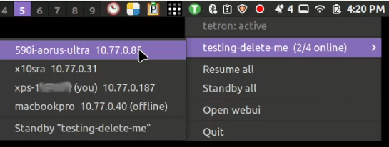

# tetron-systray


A menu-bar/tray status + quick-action client for [tetron](https://github.com/ErikAllanKincaid/tetron), a P2P mesh VPN. Talks to the existing `tetron` daemon over its Unix-socket IPC protocol — no daemon changes required.

**Optional and separate from tetron on purpose**, same as [`tetron-webui`](https://github.com/ErikAllanKincaid/tetron-webui): tetron itself stays CLI-only by default; this is a genuinely separate, opt-in product for anyone who wants glanceable menu-bar status instead of (or alongside) the browser dashboard. Nothing about tetron's own behavior changes whether this exists or not.

**Not a network picker.** Unlike Tailscale's tray (whose main job is choosing *which one* tailnet you're on), tetron can be joined to several networks simultaneously, each independently toggleable — so this tray is a status dashboard with a per-network toggle, not a switcher.



## File locations

| What | Default path |
|---|---|
| **Binary** | `/usr/local/bin/tetron-systray` (or wherever you place it) |
| **Linux service unit** | `~/.config/systemd/user/tetron-systray.service` |
| **macOS LaunchAgent** | `~/Library/LaunchAgents/com.tetron.systray.plist` |
| **macOS app bundle** | `~/Applications/TetronSystray.app` |
| **Linux logs** | systemd user journal (`journalctl --user -u tetron-systray`) |
| **macOS logs** | `~/Library/Logs/tetron-systray.log` |
| **Config** | None — everything comes via IPC from the tetron daemon |

## Running it

**Primary path: install from [`tetron-webui`](https://github.com/ErikAllanKincaid/tetron-webui)'s Add-ons panel.** Once webui is running (`http://127.0.0.1:7870`), its Add-ons panel detects, downloads, verifies, and installs `tetron-systray` in one click — no manual binary download, no `sudo`. Verified end to end on real hardware, both platforms: a fresh install correctly renders a working tray icon on Linux (GNOME) and macOS (a real M1 Mac), and re-installing over an already-running instance (e.g. to pick up an upgrade) cleanly restarts it rather than leaving the old binary in memory on either platform.

**Manual path: download a pre-built binary directly, no Rust toolchain needed.** Useful if you don't want to run `tetron-webui` at all.

```bash
# First install tetron daemon if it is not yet installed.
curl -Lo tetron https://github.com/ErikAllanKincaid/tetron/releases/latest/download/tetron-linux-x86_64
chmod +x tetron
sudo install tetron /usr/local/bin/tetron
sudo tetron install

# Linux x86_64, see the releases page for aarch64 / macOS binaries:
# https://github.com/ErikAllanKincaid/tetron-systray/releases/latest
curl -Lo tetron-systray https://github.com/ErikAllanKincaid/tetron-systray/releases/latest/download/tetron-systray-linux-x86_64
chmod +x tetron-systray
sudo install tetron-systray /usr/local/bin/tetron-systray

tetron-systray install     # sets up + starts a per-user service, no sudo needed
```

Installs a `systemd --user` unit on Linux, or a launchd **LaunchAgent** on macOS — no root needed either way, runs inside your login session (distinct from `tetron`'s own system-wide daemon service). **Auto-starts across Cinnamon, GNOME, XFCE, and KDE**: the unit lists both `WantedBy=default.target` and `graphical-session.target`, since GNOME/KDE activate the latter properly but Cinnamon/XFCE never do (found live testing on a real Cinnamon desktop — see [`docs/HOWTO_Build_A_Systray.md`](docs/HOWTO_Build_A_Systray.md) for the full story). On macOS, `install` wraps the binary in a minimal `~/Applications/TetronSystray.app` bundle (a real `CFBundleIdentifier`/`LSUIElement` are required for the status item to appear in the menu bar at all -- a bare binary does not work) and drains `NSApplication`'s own event queue each tick so clicks actually open the menu, not just a bare Cocoa run-loop pump (see [`docs/HOWTO_Build_A_Systray.md`](docs/HOWTO_Build_A_Systray.md)'s "Event loop" section for the full story).

### Building from source / development

```bash
cargo build --release   # needs GTK + libxdo + an app-indicator library on Linux first --
                         # see docs/HOWTO_Build_A_Systray.md's "System dependencies" section
```

Only needed if you're changing the code, or a pre-built binary isn't published for your platform yet.

**See [`docs/HOWTO_Build_A_Systray.md`](docs/HOWTO_Build_A_Systray.md)** for build instructions, the full crate/dependency rationale, current status (what's implemented, what isn't, what's live-tested vs. not), and — importantly — the event-loop research behind the current design (a real gotcha: `tray-icon` needs a genuine platform event loop pumping, not just a bare polling loop; not well documented anywhere as a single copy-pasteable example, so that HOWTO is worth reading before changing the event loop code).

## Upgrading

**Via `tetron-webui`'s Add-ons panel:** installing over an already-running `tetron-systray` (the same button used for the initial install) fetches the latest release and cleanly restarts the service on the new binary — verified end to end on both platforms.

**Manual path:** re-run the same install steps with a fresh binary:

```bash
curl -Lo tetron-systray https://github.com/ErikAllanKincaid/tetron-systray/releases/latest/download/tetron-systray-linux-x86_64
chmod +x tetron-systray
sudo install tetron-systray /usr/local/bin/tetron-systray   # overwrite the old binary at the same path
tetron-systray install                                        # re-registers the service and restarts it on the new binary
```

`install` is idempotent and safe to run over an already-running instance — it rewrites the unit/plist and explicitly restarts the service, so the new binary takes over immediately.

**No required order relative to the `tetron` daemon or `tetron-webui`.** The IPC wire format (`tetron-proto`) is deliberately tolerant of version skew — every message field is `#[serde(default)]`, so an older systray talking to a newer daemon just doesn't see fields it doesn't know about yet, and a newer systray talking to an older daemon sees defaults for anything the daemon hasn't started sending. There is no version handshake and nothing to break by upgrading systray before, after, or independently of the daemon or webui. (This is a different, much more tolerant contract than the mesh peer-to-peer protocol between `tetron` daemons themselves, which is a hard ALPN version gate — see `tetron`'s own `AGENTS.md` if you're wondering why that one *does* need synchronized upgrades and this doesn't.)

If a `tetron-proto` change actually adds a capability you want to use, you need the matching systray release built against it — check `tetron-systray`'s own releases page. Its version number tracks tetron core's current minor (e.g. systray `0.9.x` targets tetron `0.9`), so matching the daemon's minor version is a reasonable rule of thumb if you want to be sure you're not missing something, even though it isn't strictly required for things to keep working.

## Uninstalling

**Via `tetron-webui`'s Add-ons panel:** click Uninstall — stops the service, removes the `systemd --user` unit / launchd LaunchAgent (and, on macOS, the `~/Applications/TetronSystray.app` bundle it wraps the binary in), *and* removes the installed binary itself. Full cleanup in one click.

**Manual path:**

```bash
tetron-systray uninstall
```

Stops the service and removes the `systemd --user` unit (Linux) or launchd LaunchAgent + the `~/Applications/TetronSystray.app` bundle (macOS). **Deliberately leaves the binary itself in place** (wherever you installed it — `/usr/local/bin/tetron-systray` if you followed the manual install steps above): `uninstall` only knows how to tear down the service it registered, not delete its own currently-running executable. Remove it yourself if you want it fully gone:

```bash
sudo rm /usr/local/bin/tetron-systray
```

**Logs are also left in place**, on both platforms: Linux writes to the systemd user journal (`journalctl --user -u tetron-systray`), which isn't a file this project owns and ages out via your system's normal journal retention; macOS writes to `~/Library/Logs/tetron-systray.log`, a plain file you can delete by hand if you want.

## Architecture

```
Menu bar / tray --tray-icon/muda (native menu)--> tetron-systray --msgpack/Unix socket--> tetron daemon
```

No daemon-side changes. Depends on `tetron-proto` (tetron's shared wire-protocol crate) as a git dependency, floating on `main` rather than pinned to a release tag — same rationale as `tetron-webui`'s own `Cargo.toml` comment.

## License

MPL-2.0, matching tetron itself.
